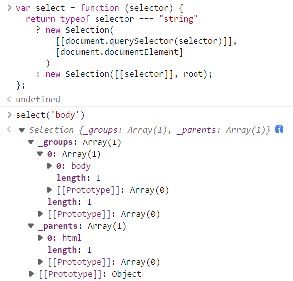
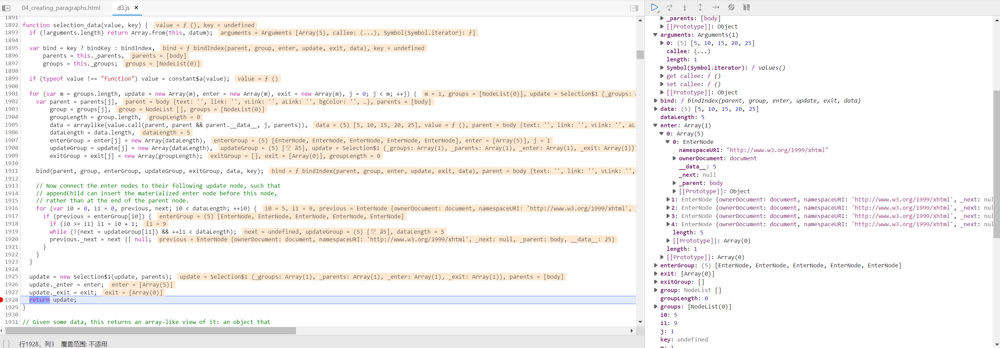

> shift 英文：转移; 挪动; 赶快; 快速移动; 变换; 更替; 变动;

- unshift() 数组`头部添加`元素
- shift() 数组`头部删除`元素
- push() 数组`末尾添加`元素
- pop() 数组`末尾删除`元素

document.documentElement 是整个 html

## 模拟 new

```js
function newFunction() {
  // 空对象
  var res = {};
  // 排除第一个构造函数参数
  // shift() 方法用于把数组的第一个元素从其中删除，其余为参数，并返回第一个元素的值，即构造函数，赋值给construct。
  var construct = Array.prototype.shift.call(arguments);
  // 为空对象、构造函数建立原型关系
  res.__proto__ = construct.prototype;
  // res对象调用construct函数，为res对象添加构造函数属性
  var conRes = construct.apply(res, arguments);
  // 判断返回类型
  return conRes instanceof Object ? conRes : res;
}

function Student(name) {
  this.name = name;
}

// Student 为构造函数， Jack 为参数，Student里使用
var instance = newFunction(Student, "Jack");

console.log(instance); // Student {"name": "Jack"}
```

## Selection

```js
// parents可能为root
function Selection(groups, parents) {
  // [[]]
  this._groups = groups;
  // []
  this._parents = parents;
}
```



## select

```js
var root = [null];

// 返回的就是 Selection 实例，包含 _groups, _parents 属性
// selector 有可能是 createElement/createElementNS 创建出来的元素节点
// 效果同 document.querySelector(tagName) 得到的节点同类
var select = function (selector) {
  return typeof selector === "string"
    ? new Selection(
        [[document.querySelector(selector)]],
        [document.documentElement]
      )
    : new Selection([[selector]], root);
};

var selectAll = function (selector) {
  return typeof selector === "string"
    ? new Selection(
        [document.querySelectorAll(selector)],
        [document.documentElement]
      )
    : new Selection([selector == null ? [] : selector], root);
};
```

## selection.append

```js
// 【眼下的一种可能】name 为 标签，如p，字符串
var selection_append = function (name) {
  // create 实际就是调用createElement(name)，创建元素节点
  var create = typeof name === "function" ? name : creator(name);
  // 返回 Selection 实例，用于链式调用
  return this.select(function () {
    return this.appendChild(create.apply(this, arguments));
  });
};

function creatorInherit(name) {
  return function () {
    // ownerDocument 属性返回节点所属的根元素，是 文档
    // documentElement 是 根节点
    var document = this.ownerDocument,
      uri = this.namespaceURI;
    // namespaceURI 获得一个 XHTML 文档的命名空间的 URI
    // 元素节点继承其父节点的命名空间，因此，XHTML 文档中的所有元素都拥有 namespaceURI "http://www.w3.org/1999/xhtml"。
    return uri === xhtml && document.documentElement.namespaceURI === xhtml
      ? document.createElement(name)
      : document.createElementNS(uri, name);
    //   createElementNS() 方法可创建带有指定命名空间的元素节点。此方法可返回一个 Element 对象。
  };
}

function creatorFixed(fullname) {
  return function () {
    return this.ownerDocument.createElementNS(fullname.space, fullname.local);
  };
}

var creator = function (name) {
  // 处理几个特殊标签，如 svg等，在namespaces中定义的5个
  // svg -> {"space": "http://www.w3.org/2000/svg","local": "svg"}
  var fullname = namespace(name);
  // 有无local属性，调用不同的方法
  return (fullname.local ? creatorFixed : creatorInherit)(fullname);
};

var xhtml = "http://www.w3.org/1999/xhtml";
var namespaces = {
  svg: "http://www.w3.org/2000/svg",
  xhtml: xhtml,
  xlink: "http://www.w3.org/1999/xlink",
  xml: "http://www.w3.org/XML/1998/namespace",
  xmlns: "http://www.w3.org/2000/xmlns/",
};

var namespace = function (name) {
  var prefix = (name += ""),
    i = prefix.indexOf(":");
  if (i >= 0 && (prefix = name.slice(0, i)) !== "xmlns")
    name = name.slice(i + 1);
  // 是否自有属性，上述5个
  return namespaces.hasOwnProperty(prefix)
    ? { space: namespaces[prefix], local: name }
    : name;
};
```

## d3.csv(url, [row], callback)

```js
d3.csv("food.csv", function (data) {});

// request 函数内部
request = {
  get: function (data, callback) {
    return request.send("GET", data, callback);
  },
  send: function (method, data, callback) {
    xhr.open(method, url, true, user, password);
  },
};

// defaultMimeType -> ,
var dsv$1 = function (defaultMimeType, parse) {
  // 我们实际调用的函数，给定url、callback
  return function (url, row, callback) {
    // 如果就给2个参数，则row置为null
    if (arguments.length < 3) (callback = row), (row = null);
    // 内部使用 request() 返回 request
    var r = request(url).mimeType(defaultMimeType); // ,
    r.row = function (_) {
      return arguments.length ? r.response(responseOf(parse, (row = _))) : row;
    };
    r.row(row);
    return callback ? r.get(callback) : r;
  };
};

var csv$1 = dsv$1("text/csv", csvParse);

exports.csv = csv$1;
```

## selection_data(value,key)

```js
var dataset = [5, 10, 15, 20, 25];

d3.select("body")
  .selectAll("p")
  .data(dataset) // selection_data
  .enter()
  .append("p")
  .text("New paragraph!");
```


